# 目录
- canvas简介
- 线
- 矩形
- 圆弧
- 渐变
- 填充
- 绘图
- 裁剪
- 文本
- 变换
- 橡皮檫
- 实现动画

----
## 一、canvas简介
**canvas**又称画布，用于在网页上绘制图形,但是它本身并没有绘制能力（它仅仅是图形的容器） , 必须使用脚本来完成实际的绘图任务,一般是使用JavaScript。

getContext() 方法可返回一个对象，该对象提供了用于在画布上绘图的方法和属性。

canvas拥有多种绘制路径、矩形、圆形、字符以及添加图像的方法

### Canvas的浏览器支持最低版本

| Safari | Firefox | IE | Chrome | Opear | iOS Safari | Android Brower |
|:--------:|:---------:|:----:|:--------:|:-------:|:-----:| :--------: |
| 3.2 | 3.5 | 9 | 9 | 10.6 | 3.2 | 2.1 |
----
### 准备工作
 1.1 添加canvas
 
```
（1）直接在body中添加canvas标签
    <canvas id="canvas">
        你的浏览器居然不支持Canvas？！赶快换一个吧！！
    </canvas>

（2）使用js脚本插入
    var canvas = document.createElement('canvas');
    canvas.style.width = '100px';
    canvas.style.height = '100px';
    document.body.appendChild(canvas);

```
----
 1.2 获取canvas对象
 
```
var canvas = document.getElementById("canvas");
```
1.3 获取画笔

```
var ctx = canvas.getContext("2d");
```
----
## 二、线段
有了画笔，我们要移动画笔（moveTo（）），确定一个起始点，下一步确定画笔终点（lineTo()）,一条直线就画好了

```
var canvas = document.getElementById("canvas");
var ctx = canvas.getContext("2d");
ctx.moveTo(50,50); //从坐标点（50,50）的位置开始
ctx.lineTo(150,50); //到坐标点（150,50）的位置结束，实际x轴偏移100，y轴没变，是一条横线
ctx.stroke(); //确定绘制
```


----
### 2.1 设置线段样式

```
(1)设置线宽
    context.lineWidth = 5;
(2)设置边框样式
    ctx.strokeStyle = "#ff00ff";
(3)设置填充样式
    ctx.fillStyle = "#ff00ff";
(4)选择绘制方式
    ctx.fill(); //实色填充
    ctx.stroke(); //线段绘制
(5)设置线端样式
    ctx.lineCap = butt //默认值，端点是垂直于线段边缘的平直边缘
    ctx.lineCap = round //端点是在线段边缘处以线宽为直径的半圆
    ctx.lineCap = square //端点是在选段边缘处以线宽为长、以一半线宽为宽的矩形
(6)设置线段连接处样式
    ctx.lineJoin = miter //默认值，在连接处边缘延长相接。miterLimit 是角长和线宽所允许的最大比例(默认是 10)。
    ctx.lineJoin = bevel //连接处是一个对角线斜角。
    ctx.lineJoin = round //连接处是一个圆。
```
-----
### 2.2 绘制多条线
因为Canvas是基于状态的绘制，后面的状态会覆盖前面的状态，如果我们需要不同的状态，需要使用beginPath()开始绘制


```
// 横向线
ctx.moveTo(50,50);
ctx.lineTo(150,50);
ctx.stroke();
// 竖向线
ctx.moveTo(50,150);
ctx.lineTo(50,50);
ctx.lineWidth = 5;
ctx.strokeStyle = '#ff00ff';
ctx.stroke();
```
###### 不使用beginPath()的效果
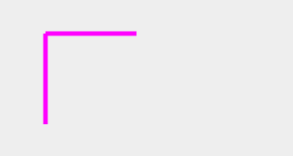

----


```
// 横向线
ctx.beginPath();
ctx.moveTo(50,50);
ctx.lineTo(150,50);
ctx.stroke();
// 竖向线
ctx.beginPath();
ctx.moveTo(50,150);
ctx.lineTo(50,50);
ctx.lineWidth = 5;
ctx.strokeStyle = '#ff00ff';
ctx.stroke();
```

###### 使用beginPath()的效果
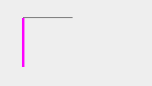

----
### 2.3 闭合线段closePath()
因为设置线宽会导致线段闭合有缺口，线宽越大缺口越明显，所以用closePath()来闭合缺口

```
// 正方形
ctx.beginPath();
ctx.moveTo(250,50);
ctx.lineTo(450,50);
ctx.lineTo(450,250);
ctx.lineTo(250,250);
ctx.lineTo(250,50);
ctx.fillStyle = "pink";
ctx.lineWidth = 8;
ctx.strokeStyle = '#000';
ctx.fill();
ctx.stroke();
```
----
###### 不使用closePath()的效果
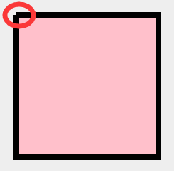

----

```
// 正方形
ctx.beginPath();
ctx.moveTo(250,50);
ctx.lineTo(450,50);
ctx.lineTo(450,250);
ctx.lineTo(250,250);
ctx.closePath();
ctx.fillStyle = "pink";
ctx.lineWidth = 8;
ctx.strokeStyle = '#000';
ctx.fill();
ctx.stroke();
```
###### 使用closePath()的效果
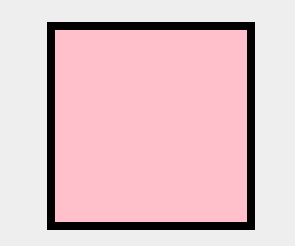

----

## 三、矩形
原理还是绘制线段、闭合图形，因为实际工作中矩形用到的较多，所以canvas封装了一个绘制矩形的方法：

----
**绘制矩形  rect(x,y,width,height)**

```
ctx.beginPath();
ctx.rect(50,50,100,100);
ctx.stroke();
ctx.beginPath();
ctx.rect(50,200,100,100);
ctx.fill();
for(var i = 0; i<30; i++){
	ctx.beginPath();
	ctx.strokeStyle = 'green';
	ctx.rect(350-i*5,200-i*5,20+i*10,20+i*10);
	ctx.stroke();
}

```
----

###### 效果图
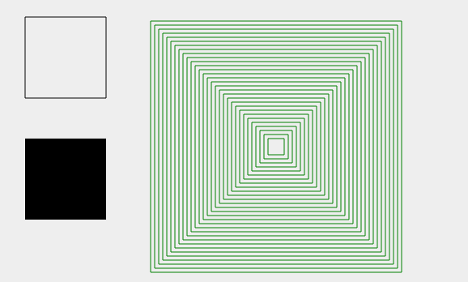

----

**结合版  fillRect(x,y,width,height)、strokeRect(x,y,width,height)**

```
ctx.beginPath();
ctx.fillStyle = 'red';
ctx.fillRect(600,50,100,100);
ctx.beginPath();
ctx.strokeStyle = 'red';
ctx.strokeRect(600,200,100,100);
```
###### 效果图
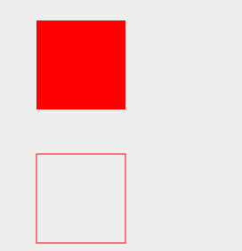
 
 ----
 
## 四、圆弧

### 4.1 标准圆弧：arc(x,y,radius,startAngle,endAngle,anticlockwise)
x,y表示圆心，radius表示圆弧半径，startAngle表示起始弧度(注意单位是弧度π)，endAngle表示结束弧度，anticlockwise表示顺时针逆时针，true表示逆时针，false顺时针，默认为false

----

```
ctx.beginPath();
ctx.arc(100,100,100,0,0.5);
```
###### 效果图
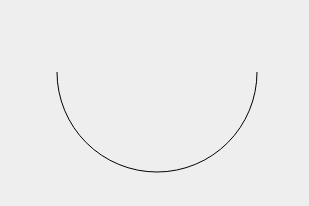

----


### 4.2 切点绘圆弧：arcTo(x1,y1,x2,y2,radius)
arcTo是以给定的半径绘制一条弧线，圆弧的起点与当前路径的位置到(x1, y1)点的直线相切，圆弧的终点与(x1, y1)点到(x2, y2)的直线相切

---- 

```
ctx.beginPath();
ctx.moveTo(500,100);
ctx.lineTo(600,100);
ctx.lineTo(600,200);
ctx.stroke();

ctx.beginPath();
ctx.moveTo(500,100);
ctx.arcTo(600, 100, 600, 200, 100);
ctx.strokeStyle = 'red'
ctx.stroke();
```
###### 效果图
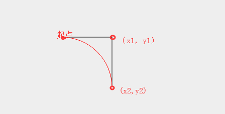

----


### 4.3 二次贝塞尔曲线：quadraticCurveTo(x1,y1,x2,y2)
Bézier curve(贝塞尔曲线)是应用于二维图形应用程序的数学曲线。 曲线定义：起始点、控制点、终止点。通过调整控制点，贝塞尔曲线的形状会发生变化。**贝塞尔曲线是一条由起始点、终止点和控制点所确定的曲线就行了。而n阶贝塞尔曲线就有n-1个控制点。**
推荐一个[在线转换器](http://blogs.sitepointstatic.com/examples/tech/canvas-curves/quadratic-curve.html)

----

```
//辅助切线 
ctx.beginPath();
ctx.moveTo(50,300);
ctx.lineTo(150,100);
ctx.lineTo(250,300);
ctx.stroke();
//二次贝塞尔曲线
ctx.beginPath();
ctx.moveTo(50,300);
ctx.quadraticCurveTo(150,100,250,300);
ctx.strokeStyle = 'red';
ctx.stroke();
```
###### 效果图


----


### 4.4 三次贝塞尔曲线：bezierCurveTo(x1,y1,x2,y2,x3,y3)
n阶贝塞尔曲线就有n-1个控制点，所以三次贝塞尔曲线有1个起点、2个控制点、1个终止点;x1,y1表示第一个控制点，x2,y2表示第二个控制点，x3,y3表示终点。推荐一个[在线转化器](http://blogs.sitepointstatic.com/examples/tech/canvas-curves/bezier-curve.html)

----

```
var canvas = document.getElementById('canvas');
var ctx = canvas.getContext('2d');
// 蛙脸轮廓
ctx.beginPath();
ctx.moveTo(170, 325);
ctx.bezierCurveTo(38, 317, 81, 224, 141, 229);
ctx.bezierCurveTo(141, 229, 149, 138, 178, 229);
ctx.bezierCurveTo(191, 170, 210, 180, 221, 229);
ctx.bezierCurveTo(270, 240, 305, 325, 170, 325);
ctx.fillStyle = '#61d40c';
ctx.fill();
ctx.stroke();
```
----

```
// 蛙左眼睛
ctx.beginPath();
ctx.moveTo(155, 231);
ctx.bezierCurveTo(152, 216, 169, 217, 165, 231);//112, 236, 129, 237, 129, 252
ctx.fillStyle = "black";
ctx.fill();
// 蛙左眼睛
ctx.beginPath();
ctx.moveTo(195, 231);
ctx.bezierCurveTo(192, 216, 209, 217, 205, 231);//112, 236, 129, 237, 129, 252
ctx.fillStyle = "black";
ctx.fill();
```
###### 效果图
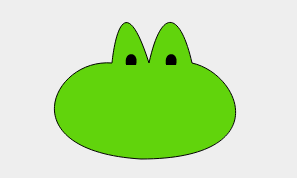

----

## 五、 填充
### 5.1 实色填充fill()
fill()是进行颜色填充，fillStyle用来设置颜色值，颜色值可以是多种类型的

----
##### 1. 颜色字符串表示

```
ctx.fillStyle = 'red';
```
##### 2. 十六进制字符串表示

```
ctx.fillStyle = '#FF00FF';
```
##### 3. 十六进制字符串简写形式表示

```
ctx.fillStyle = '#F0F';
```
##### 4. rgba()表示

```
ctx.fillStyle = 'rgba(255,0,0,0.6)';
```
##### 5. hsla()表示

```
ctx.fillStyle = 'hsla(255,50%,50%,0.8)';
```
----
### 5.2 渐变填充
渐变分为线性渐变和径向渐变，线性渐变是基于两个端点定义的，径向渐变是基于两个圆定义的
填充渐变分为三步：添加渐变线，为渐变线添加关键色断点，应用渐变；

----

##### 1. 线性渐变createLinearGradient(startx,starty,endx,endy)

```
// 图一线性渐变--从左至右
// 创建渐变
var grad = ctx.createLinearGradient(50,70,200,70);
//为渐变添加颜色断点
grad.addColorStop(0,'rgba(0,0,0,.5)');
grad.addColorStop(0.5,'rgba(0,0,0,0)');
grad.addColorStop(1,'rgba(0,0,0,.5)');
ctx.beginPath();
ctx.fillStyle = grad;
ctx.fillRect(50,70,150,250);
```
----
```
// 图二线性渐变--从上至下
ctx.beginPath();
// 创建渐变
var grad1 = ctx.createLinearGradient(325,70,325,320);
//为渐变添加颜色断点
grad1.addColorStop(0,'rgba(0,0,0,.5)');
grad1.addColorStop(0.2,'rgba(255,0,0,.5)');
grad1.addColorStop(0.4,'rgba(0,255,0,.5)');
grad1.addColorStop(0.6,'rgba(0,0,255,.5)');
grad1.addColorStop(0.8,'rgba(255,255,0,.5)');
grad1.addColorStop(1,'rgba(0,255,255,.5)');
ctx.fillStyle = grad1;
ctx.fillRect(250,70,150,250);
```
----
```
// 图三线性渐变--从左上至右下
ctx.beginPath();
// 创建渐变
var grad2 = ctx.createLinearGradient(450,70,600,320);
//为渐变添加颜色断点
grad2.addColorStop(0,'rgba(0,0,0,.5)');
grad2.addColorStop(0.2,'rgba(255,0,0,.5)');
grad2.addColorStop(0.4,'rgba(0,255,0,.5)');
grad2.addColorStop(0.6,'rgba(0,0,255,.5)');
grad2.addColorStop(0.8,'rgba(255,255,0,.5)');
grad2.addColorStop(1,'rgba(0,255,255,.5)');
ctx.fillStyle = grad2;
ctx.fillRect(450,70,150,250);
```

----

###### 效果图
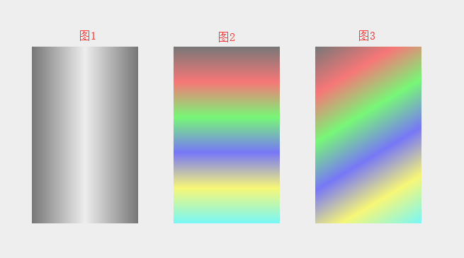

----

##### 2. 径向渐变createLinearGradient(x0,y0,r0,x1,y1,r1)
x0,y0表示起点圆心位置，r0表示起点圆心半径，x1,y1表示终点圆心位置，r1表示终点圆心半径

----
```
ctx.beginPath();
ctx.moveTo(720,200);
var grad3 = ctx.createRadialGradient(720,200,0,720,200,80);
grad3.addColorStop(0,'rgba(0,0,0,.5)');
grad3.addColorStop(0.2,'rgba(255,0,0,.5)');
grad3.addColorStop(0.4,'rgba(0,255,0,.5)');
grad3.addColorStop(0.6,'rgba(0,0,255,.5)');
grad3.addColorStop(0.8,'rgba(255,255,0,.5)');
grad3.addColorStop(1,'rgba(0,255,255,.5)');
ctx.fillStyle = grad3;
ctx.arc(720,200,80,0.2*Math.PI,1.8*Math.PI);
ctx.fill();

```
###### 效果图
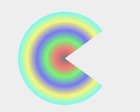

----
### 5.3 背景图填充createPattern(img,repeat-style)
**repeat-style的值有：**
1. 平面上重复：repeat;
2. x轴上重复：repeat-x;
3. y轴上重复：repeat-y;
4. 不使用重复：no-repeat;

----
```
var canvas = document.getElementById('canvas');
var ctx = canvas.getContext('2d');
ctx.beginPath();
var img = new Image();
img.src = 'images/bg.jpg';
img.onload = function(){
	var bg = ctx.createPattern(img,'repeat');
	ctx.fillStyle = bg;
	ctx.fillRect(0,0,856,398);
}
```
----

###### 效果图
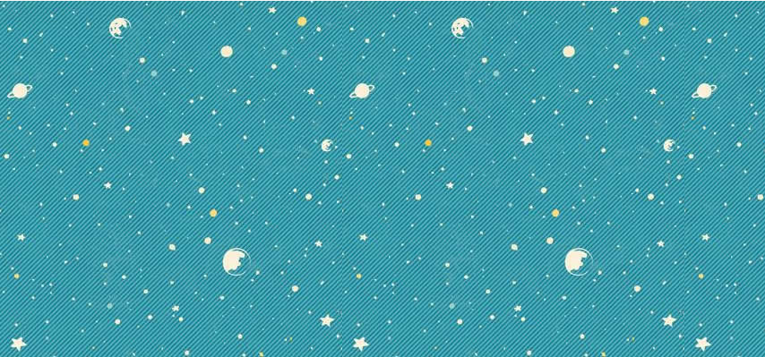

-----

## 六、 绘图

### 6.1绘制图像drawImage(img,sx,sy,swidth,sheight,x,y,width,height)
drawImage可以引入图像、画布、视频，并对其进行缩放或裁剪;它有几种表现形式：

----
1. 三参数：context.drawImage(img,x,y)
2. 五参数：context.drawImage(img,x,y,width,height)

        width,height表示图像的宽高，可以被压缩拉伸
3. 九参数：context.drawImage(img,x1,y1,width1,height1,x2,y2,width2,height2)

        x1,y1表示在图像上开始裁切的位置；
        
        width1,height1表示要裁切的宽高；
        
        x2,y2表示裁切的图像在画布上显示的位置；
        
        width2,height2表示要裁切的图像的宽高；
        
----

代码：
```
var canvas = document.getElementById('canvas');
var ctx = canvas.getContext('2d');
ctx.beginPath();
var img = new Image();
img.src = 'images/tree31.png';
img.onload = function(){
	// 三参数
	ctx.drawImage(img,0,0);
	// 五参数
	ctx.drawImage(img,220,190,100,100);
	// 五参数-压缩拉伸
	ctx.drawImage(img,320,100,100,200);
	// 九参数
	ctx.strokeRect(520,90,100,100)
	ctx.drawImage(img,50,50,100,100,520,90,100,100);
}
```
----
###### 效果图
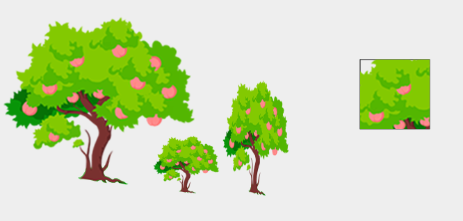

-----


### 6.2裁剪图像clip()
在使用clip之前先用save保存之前画布的状态，然后绘制路径，裁剪路径区域内的画布，绘制结束用restore退出裁剪状态

----
```
ctx.beginPath();
var img = new Image();
img.src = 'images/tree31.png';
img.onload = function(){
	// 三参数
	ctx.drawImage(img,0,0);
	// 五参数
	ctx.drawImage(img,220,190,100,100);
	ctx.save();//在裁剪画布前保存之前的状态
	ctx.arc(365,160,40,0,2*Math.PI);
	ctx.stroke();
	ctx.clip();//根据裁剪路径裁剪画布
	// 五参数-压缩拉伸
	ctx.drawImage(img,320,100,100,200);//只能显示裁剪区域内的图像
	ctx.restore();//退出裁剪，后面正常显示
	// 九参数
	ctx.strokeRect(520,90,100,100)
	ctx.drawImage(img,50,50,100,100,520,90,100,100);
}
```
----

###### 效果图
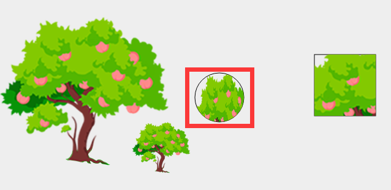

----

## 七、 文本
### 7.1设置字体font
font可以设置字体大小、行高、什么字体、字体粗细、是否倾斜； 可以不指定，默认为10px 无衬线体

设置字体属性顺序，不能乱

[font-style] [font-variant] [font-weight] 
[font-size/line-height] [font-family]


```
ctx.font = 'italic small-caps bold 20px/40px arial' 
```
-----
### 7.2设置字体颜色fontStyle

```
ctx.fontStyle = '#ff0000' 
```
----
### 7.3显示字体fillText(text,x,y,[maxlen])
text表示要填充的文本，x、y表示字体显示的位置,maxlen可选参数，表示限制文字宽度,超出宽度，文字会被压缩

```
ctx.fillText('Study Canvas',100,100) 
```

----

值 | 描述
---------|---
font-style | 1.normal 2.italic 3.oblique
font-variant | 1.normal 2.small-caps
font-weight | 1、normal 2、bold 3、bolder 4、lighter 5、100 6、200 7、300 8、400 9、500 10、600 11、700 12、800 13、900
font-size / line-height |	规定字号和行高，以像素计。
font-family	| 规定字体系列

----

### 7.3显示描边字体strokeText(text,x,y,[maxlen])
文字以描边显示，属性、参数和fillText一样
```
ctx.strokeText('Study Canvas',100,100,100) 
```
----
### 7.4文本对齐
#### 水平对齐 textAlign

```
ctx.textAlign="center|end|left|right|start";
```
----
#### 垂直对齐 textBaseline

```
ctx.textBaseline="alphabetic|top|hanging|middle|ideographic|bottom";

```
值 | 描述
-- | --
alphabetic | 默认。文本基线是普通的字母基线。
top	| 文本基线是 em 方框的顶端。
hanging	| 文本基线是悬挂基线。
middle	| 文本基线是 em 方框的正中。
ideographic	| 文本基线是表意基线。
bottom	| 文本基线是 em 方框的底端。

----
### 7.5文本度量measureText
这个api在换行显示判断中会有奇效

```
var font_w = ctx.measureText(text).width;
```
----

```
var canvas = document.getElementById('canvas');
var ctx = canvas.getContext('2d');
ctx.font = 'italic small-caps bold 20px/40px arial ' 
ctx.fillStyle = '#ff0000'
ctx.fillText('Study Canvas',50,100)

// 限制文本宽度
ctx.beginPath();
ctx.fillStyle = '#ff00ff'
ctx.fillText('设置了文本宽度，字体会被压缩',50,150,200)

// 设置描边文本
ctx.beginPath();
ctx.strokeStyle = '#ff00ff'
ctx.strokeText('设置了描边文本',50,200)

```
----

```
// 设置背景图填充
ctx.beginPath();
var img = new Image();
img.src = 'images/bg.jpg';
img.onload = function(){
	var bg = ctx.createPattern(img,'repeat');
	ctx.fillStyle = bg;
	ctx.fillText('设置了背景图填充文本',50,250)
}

// 设置渐变填充
ctx.beginPath();
var grad = ctx.createLinearGradient(50,300,150,400);
grad.addColorStop(0,'rgba(0,0,0,.5)');
grad.addColorStop(0.2,'rgba(255,0,0,.5)');
grad.addColorStop(0.4,'rgba(0,255,0,.5)');
grad.addColorStop(0.6,'rgba(0,0,255,.5)');
grad.addColorStop(0.8,'rgba(255,255,0,.5)');
grad.addColorStop(1,'rgba(0,255,255,.5)');
ctx.fillStyle = grad;
ctx.textAlign = "left";
ctx.textBaseline = "middle";
ctx.fillText('设置了渐变色填充文本',50,300)

```
----

```
// 文字度量衡获取文字长度
ctx.beginPath();
var text = '测试文字长度';
var font_w = ctx.measureText(text).width;
ctx.fillStyle = 'pink';
ctx.fillText(text,350,100)
ctx.fillText('width:'+font_w,350,150)
```

###### 效果图
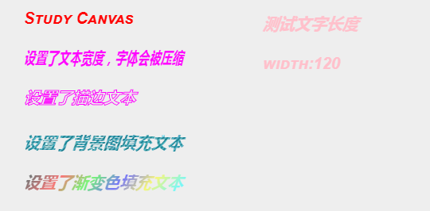

----

## 八、变换
### 8.1平移变换translate(x,y)
平移变换实质就是在平移坐标系，坐标系变换之后会影响后面图形位置，如果不想影响后面绘图，要使用translate(-x,-y)把坐标系移回（0,0）的位置;**切记，千万不要再想着我继续紧接着第一次平移之后再平移，这样坐标系就会很乱，在多次变换或者封装函数之后，根本找不到坐标系原点在哪。所以一定要以最初状态为最根本的参照物，这是原则性问题**

----

```
var canvas = document.getElementById('canvas');
var ctx = canvas.getContext('2d');
ctx.fillStyle = 'red';
ctx.fillRect(0,0,100,100);
// 平移坐标系
ctx.translate(100,100);
ctx.fillStyle = 'green';
ctx.fillRect(0,0,100,100);
// 将坐标系移回（0,0）位置
ctx.translate(-100,-100);
ctx.fillStyle = 'orange';
ctx.fillRect(0,200,100,100);
```

----
###### 效果图
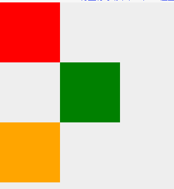

-----

### 8.2旋转变换rotate(deg)
rotate(deg)传入的参数是弧度，不是角度，同translate一样，rotate旋转之后会对后面的绘图有影响，解除影响用rotate(-deg)；默认旋转是以坐标系的原点（0，0）为圆心进行的顺时针旋转，在使用rotate时，通常是先使用translate()平移坐标系，确定旋转的圆心，之后再进行旋转。即，旋转变换通常搭配平移变换使用的；


**注意：平移结合旋转使用的时候，先translate后rotate,那么恢复原状态的时候就要先rotate后translate**

----

```
// 旋转--以默认（0,0）为圆心旋转
ctx.rotate(0.1*Math.PI);
ctx.fillStyle = 'pink';
ctx.fillRect(300,100,100,100);
// 旋转回默认状态
ctx.rotate(-0.1*Math.PI);

```
----

```

// 旋转--以矩形圆心为圆心旋转
ctx.translate(350,150);
ctx.rotate(0.1*Math.PI);
ctx.fillStyle = 'rgba(0,0,0,.2)';
ctx.fillRect(-50,-50,100,100);
ctx.rotate(0.1*Math.PI);
ctx.fillRect(-50,-50,100,100);
ctx.rotate(0.1*Math.PI);
ctx.fillRect(-50,-50,100,100);
ctx.rotate(0.1*Math.PI);
ctx.fillRect(-50,-50,100,100);
ctx.rotate(0.1*Math.PI);
ctx.fillRect(-50,-50,100,100);
// 旋转结束之后记得恢复平移、旋转之前的状态
ctx.rotate(-0.5*Math.PI);
ctx.translate(-350,-150);

//后面状态不受影响
ctx.fillRect(500,100,100,100);
```
----

###### 效果图
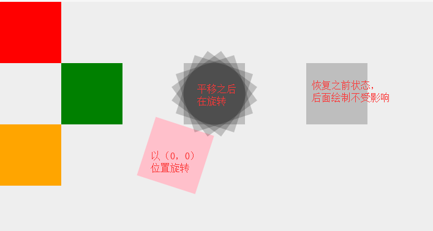

----

### 8.3缩放变换scale(sx,sy)
sx表示水平缩放的倍数，sy表示垂直缩放的倍数；缩放变换有两点需要注意：
1. 缩放时，图像左上角坐标的位置会对应缩放。
2. 缩放时，图像线条的粗细也会对应缩放。
3. 多次缩放时，都会在上次缩放的基础上累加缩放，如果要消除影响在开始缩放前先用save()保存状态，结束后再用restore()退出缩放状态

解决办法：
1. 解决左上角位置缩放的问题，平移坐标系，让图像的左上角为（0,0）
2. 线条的粗细问题没有很好的解决办法，可以提前定义线条宽度，图像放大几倍，线条宽度对应的缩小几倍 

----

```
var canvas = document.getElementById('canvas');
var ctx = canvas.getContext('2d');

// 缩放
//默认的影响
ctx.save();
ctx.scale(1.5,1.5);
ctx.strokeRect(0,0,60,60);
ctx.scale(1.5,1.5);
ctx.strokeRect(0,0,60,60);
ctx.scale(1.5,1.5);
ctx.strokeRect(0,0,60,60);
ctx.restore();

// 消除缩放影响
ctx.save();
ctx.scale(1.5,1.5);
ctx.strokeStyle = 'red';
ctx.strokeRect(200,100,60,60);
ctx.restore();
ctx.save();
ctx.scale(1.5,1.5);
ctx.strokeStyle = 'green';
ctx.strokeRect(300,100,60,60);
ctx.restore();
```
----
###### 效果图
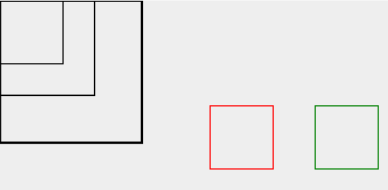

----

### 8.4矩阵变换transform(a,b,c,d,e,f)
各参数意义对应如下表：

参数 |	意义
--- | ---
a |	水平缩放(1)
b |	水平倾斜(0)
c |	垂直倾斜(0)
d |	垂直缩放(1)
e |	水平位移(0)
f |	垂直位移(0)

1. 可以使用ctx.transform (1,0,0,1,dx,dy)代替ctx.translate(dx,dy)
2. 可以使用ctx.transform(sx,0,0,sy,0,0)代替ctx.scale(sx, sy)
3. 使用ctx.transform(0,b,c,0,0,0)来实现倾斜效果(最实用)。


----

```
ctx.save();
ctx.transform(1,0,0,1,20,20);
ctx.fillStyle = 'red';
ctx.fillRect(0,0,100,100);
ctx.restore();
//代替scale
ctx.save();
ctx.transform(2,0,0,2,0,0);
ctx.fillStyle = 'green';
ctx.fillRect(50,50,100,100);
ctx.restore();
// 倾斜
ctx.save();
ctx.transform(1,0,1,1,0,0);
ctx.fillStyle = 'orange';
ctx.fillRect(350,100,100,100);
ctx.restore();
```
----
###### 效果图
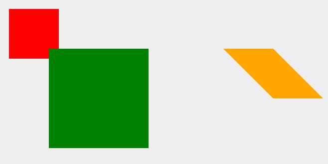

-----
## 九、橡皮檫clearRect(x,y,w,h)

----

```
var canvas = document.getElementById('canvas');
var ctx = canvas.getContext('2d');

function Draw(){
  ctx.beginPath();
  var img = new Image();
  img.src = 'images/bg.jpg';
  img.onload = function(){
      var bg = ctx.createPattern(img,'repeat');
      ctx.fillStyle = bg;
      ctx.fillRect(0,0,856,398);
  }
}
Draw();

```
----

```
var x = 0,y = 1,dir = 1;
setInterval(function(){
x += 2;
if(x == 858){
	x = 0;
	y += 1
	dir = -dir;
	if(y == 11){
		x = 0;
		y = 1;
		dir = 1;
		Draw();
	}
}
var _x = dir > 0 ? x : 856 - x
var dx = dir > 0 ? 0 : 856 - x
ctx.clearRect(dx,0,_x,39.8*y)
},10)
```
----
## 十、实现动画
canvas上的图像就是一个个像素点组成的集合，不是一个整体，想要实现动画效果，只能重新绘制，但是canvas的状态是保存的，在重新绘制之前要先清除画布；

**所以canvas动画的原理就是：清画布→绘制→清画布→绘制→清画布→绘制→清画布→绘制→清画布→绘制...,这种重复的动作可以用定时器setInterval实现**

-----

## 扩展--google开发辅助工具


### 1.JSONview插件
解析json数据
### 2.Charset插件
修改网站的默认编码
### 3.谷歌访问助手插件
免费访问：谷歌搜索，Gmail邮箱，Chrome商店...
### 4.设置谷歌浏览器跨域 
先在C盘建一个文件夹ChromeDebug,然后右键打开谷歌浏览器快捷方式属性菜单，在目标地址后面加上下面的字符串
--disable-web-security --user-data-dir=C:\ChromeDebug

-----

                                            谢谢